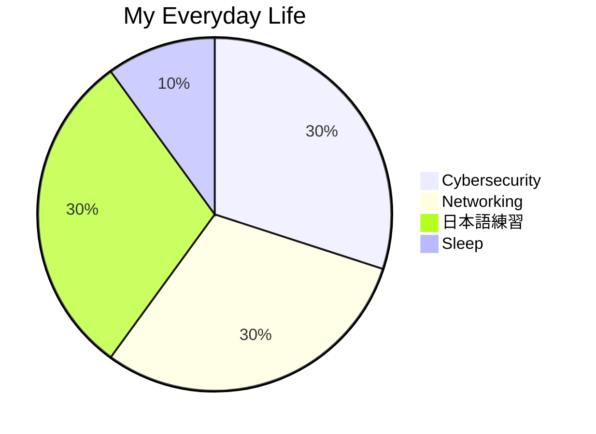
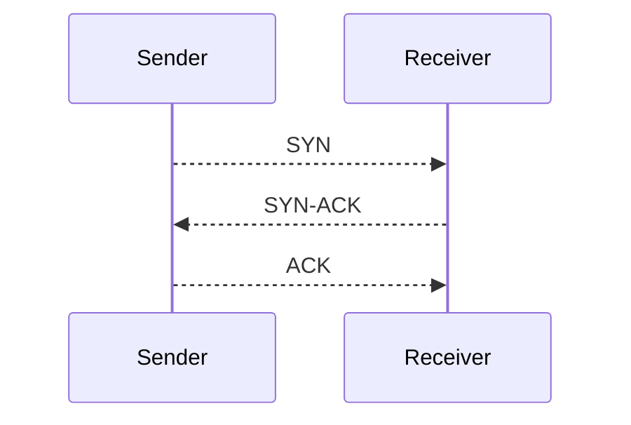
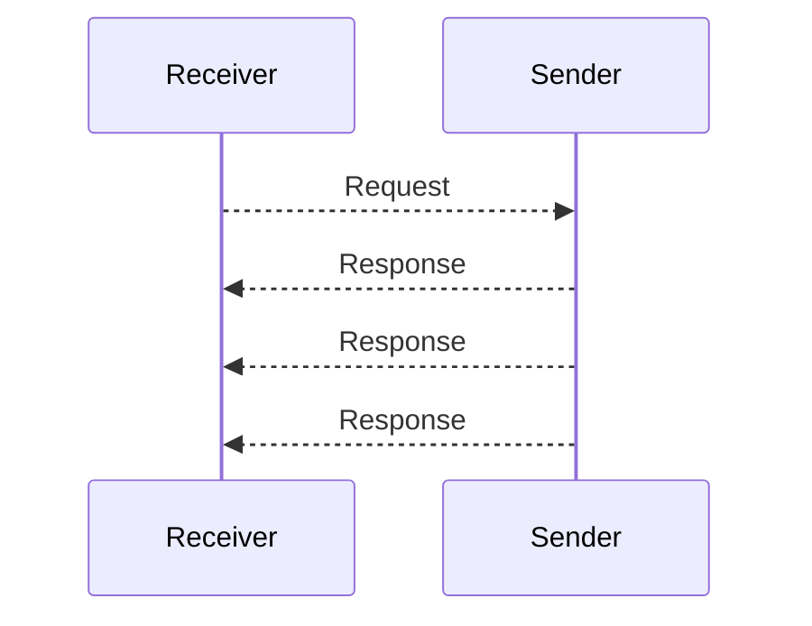

---
cssclasses:
  - mermaid
---

```mermaid
pie title My Everyday Life
"Cybersecurity": 30
"Networking": 30
"日本語練習": 30
"Sleep": 10
```

#### TCP Handshake

```mermaid
sequenceDiagram

Sender -->> Receiver: SYN
Receiver -->> Sender: SYN-ACK
Sender -->> Receiver: ACK
```

#### UDP Handshake

```mermaid
sequenceDiagram

Receiver -->> Sender: Request
Sender -->> Receiver: Response
Sender -->> Receiver: Response
Sender -->> Receiver: Response
```

